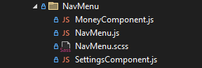
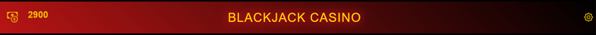

# Dokumentacja DTR

## Spis treści:
1. Foldery z mediami
2. Folder "src"
3. Folder components
4. Folder Bet
5. Folder Cards
6. Folder Context
7. Folder Game
8. Folder GameOver
9. Folder Home
10. Folder NavMenu

## Zawartość głównego folderu ClientApp:

 

### 1. Foldery z mediami

 

- "**Cards**” zawiera zdjęcia kart które są wyświetlane w grze.

- "**Others**” zawiera pliki mp3 oraz zdjęcie krupiera i żetonów.

### 2. Folder „src” 
 

Zawiera pliki źródłowe aplikacji, które są niezbędne do jej uruchomienia i działania. 
W jego wnętrzu znajdują się takie pliki jak: 

- "**App.js**” - jest głównym komponentem aplikacji React, który definiuje strukturę tras i renderuje główny layout, w tym wszystkie komponenty aplikacji, zgodnie z konfiguracją tras z pliku AppRoutes.js.

- "**AppRoutes.js**” - zawiera konfigurację tras dla aplikacji, gdzie każda trasa jest reprezentowana jako obiekt. Obecnie zdefiniowana jest tylko jedna trasa dla głównej strony domowej, której elementem jest komponent Home. Pozostałe trasy zostały zakomentowane.

- "**custom.css**” - definiuje niestandardowe style CSS dla „App.js”

- "**index.js**” - jest plikiem głównym aplikacji React. Renderuje korzeń aplikacji w elemencie o id "root", używając przeglądarki routingu do zarządzania trasami, rejestruje serwis pracownika (Service Worker) do obsługi funkcji PWA i raportowania wskaźników internetowych.

### 3. Folder „components” 

 

Zawiera zestaw komponentów, które są używane w aplikacji do budowania różnych widoków i funkcjonalności.
W jego wnętrzu znajdują się takie pliki jak:

- "**Home.js**" zawiera główny komponent reprezentujący ekran główny gry.

- "**Layout.js**" odpowiada za definiowanie ogólnego układu aplikacji i zapewnienie dostępu do magazynu Redux dla wszystkich komponentów podrzędnych.

- "**NavMenu-old.js**" definiuje menu nawigacyjne aplikacji i obsługuje jego interakcje, takie jak rozwijanie i zwijanie, oraz definiuje odnośniki do różnych części aplikacji.

- "**Style.scss**" określa styl dla menu nawigacyjnego oraz strony głównej

- Foldery: "Bet", "Cards", "Context", "Game", "GameOver", "Home", "NavMenu"

### 4. Folder "Bet"

 
 
W folderze "Bet" znajdują się pliki związane ze stawianiem zakładu.

 

  

- "**Bet.js**" zawiera komponent zarządzający procesem obstawiania zakładów.

- "**Bet.scss**" zawiera stylowanie komponentów odpowiedzialnych za stawianie zakładu.

- "**BetController.jsx**"  zawiera komponent odpowiedzialny za kontrolę akcji podczas rozgrywki. Takich jak: Dobranie karty, podwojenie zakładu i pasowanie. 

- "**BetController.scss**" zawiera stylowanie komponentów odpowiedzialnych za kontrolę akcji podczas rozgrywki

- "**EndGameComponent.jsx**" zawiera komponent odpowiedzialny za wyświetlanie informacji o zakończeniu gry oraz umożliwia użytkownikowi uruchomienie nowej gry.

- "**MoneyBet.jsx**" zawiera komponent odpowiedzialny za umożliwienie użytkownikowi postawienia zakładu o określonej kwocie pieniędzy. 

### 5. Folder "Cards"

 

W folderze "Cards" znajdują się pliki związane z renderowaniem kart i liczeniem punktów.

- "**CardComponent.jsx**" zawiera komponent odpowiedzialny za renderowanie pojedynczej karty do gry.

- "**CardPoints.js**" oraz "**CardPoints.ts**" zawiera komponent odpowiedzialny za liczenie punktów z kart

### 6. Folder "Context"

 

W folderze "Context" znajdują się pliki związane z zarządzaniem stanem aplikacji.

- "**CardSlice.js**" - Plik zawierający reduktor i akcje związane z zarządzaniem stanem kart w grze, takie jak dodawanie kart do ręki gracza i krupiera, resetowanie kart itp.

- "**GameManageSlice.js**" - Plik zawierający reduktor i akcje związane z zarządzaniem stanem gry, takie jak rozpoczęcie i zakończenie gry, określenie zwycięzcy itp.

- "**ProfileSlice.js**" - Plik zawierający reduktor i akcje związane z zarządzaniem profilem gracza, takie jak zmiana ilości pieniędzy, ustalanie zakładu itp.

- "**ActionsContext.js**" - Plik zawierający kontekst React do zarządzania dostępnymi akcjami w grze, takimi jak podwojenie, rozdwojenie itp.

### 7. Folder "Game"

 

W folderze "Game" znajdują się pliki związane z logiką gry, zarządzaniem kartami i rozgrywką.

 

- "**GameManager.jsx**" - Plik zawierający główny komponent zarządzający logiką gry, taką jak rozdawanie kart, ustalanie wyniku itp.

- "**GameManager.scss**" - zawiera stylowanie generowanych kart oraz liczników punktów.

- "**RandomCard.js**" - Plik zawierający funkcję generującą losową kartę.

### 8. Folder "GameOver"

 

W folderze "GameOver" znajdują się pliki związane z ekranem końca gry.

 

- "**GameOver.jsx**" - Plik zawierający komponent wyświetlający ekran końca gry, informujący gracza o wyniku i umożliwiający rozpoczęcie nowej gry.

- "**Game Over.scss**" - zawiera stylowanie ekranu końca gry.

### 9. Folder "Home"

 

W folderze "Home" znajdują się pliki związane z ekranem głównym gry.

 
 

- "**BackgroundMusic.jsx**" - zawiera komponent ekranu odpowiedzialny za muzykę w tle.

- "**Croupier.jsx**" - zawiera komponent odpowiedzialny za pojawienie sie krupiera oraz spadających żetonów.

### 10. Folder "NavMenu"

 

W folderze "NavMenu" znajdują się pliki związane z menu nawigacyjnym aplikacji:

  

- "**MoneyComponent.js**" - odpowiada za utworzenie ikonki pieniędzy. 
- "**NavMenu.js**" - odpowiada za zawartość menu nagłówkowego na górze ekranu.
- "**NavMenu.scss**" - zawiera stylowanie menu nagłówkowego na górze ekranu.
- "**SettingsComponent.js**" - odpowiada za utworzenie ikonki ustawień. 

