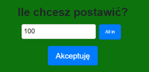

## Zawartoœæ g³ównego folderu ClientApp:

 

### 1. Foldery z mediami:

 

- "**Cards**” zawiera zdjêcia kart które s¹ wyœwietlane w grze.

- "**Others**” zawiera pliki mp3 oraz zdjêcie krupiera i ¿etonów.

### 2. Folder „src” 

 

Zawiera pliki Ÿród³owe aplikacji, które s¹ niezbêdne do jej uruchomienia i dzia³ania. 
W jego wnêtrzu znajduj¹ siê takie pliki jak: 

- "**App.js**” - jest g³ównym komponentem aplikacji React, który definiuje strukturê tras i renderuje g³ówny layout, w tym wszystkie komponenty aplikacji, zgodnie z konfiguracj¹ tras z pliku AppRoutes.js.

- "**AppRoutes.js**” - zawiera konfiguracjê tras dla aplikacji, gdzie ka¿da trasa jest reprezentowana jako obiekt. Obecnie zdefiniowana jest tylko jedna trasa dla g³ównej strony domowej, której elementem jest komponent Home. Pozosta³e trasy zosta³y zakomentowane.

- "**custom.css**” - definiuje niestandardowe style CSS dla „App.js”

- "**index.js**” - jest plikiem g³ównym aplikacji React. Renderuje korzeñ aplikacji w elemencie o id "root", u¿ywaj¹c przegl¹darki routingu do zarz¹dzania trasami, rejestruje serwis pracownika (Service Worker) do obs³ugi funkcji PWA i raportowania wskaŸników internetowych.

### 3. Folder „components” 

 

Zawiera zestaw komponentów, które s¹ u¿ywane w aplikacji do budowania ró¿nych widoków i funkcjonalnoœci.
W jego wnêtrzu znajduj¹ siê takie pliki jak:

- "**Home.js**" zawiera g³ówny komponent reprezentuj¹cy ekran g³ówny gry.

- "**Layout.js**" odpowiada za definiowanie ogólnego uk³adu aplikacji i zapewnienie dostêpu do magazynu Redux dla wszystkich komponentów podrzêdnych.

- "**NavMenu-old.js**" definiuje menu nawigacyjne aplikacji i obs³uguje jego interakcje, takie jak rozwijanie i zwijanie, oraz definiuje odnoœniki do ró¿nych czêœci aplikacji.

- "**Style.scss**" okreœla styl dla menu nawigacyjnego oraz strony g³ównej

- Foldery: "Bet", "Cards", "Context", "Game", "GameOver", "Home", "NavMenu"

### 4. Folder "Bet"

 
 
W folderze "Bet" znajduj¹ siê pliki zwi¹zane ze stawianiem zak³adu.

 

  

- "**Bet.js**" zawiera komponent zarz¹dzaj¹cy procesem obstawiania zak³adów.

- "**Bet.scss**" zawiera stylowanie komponentów odpowiedzialnych za stawianie zak³adu.

- "**BetController.jsx**"  zawiera komponent odpowiedzialny za kontrolê akcji podczas rozgrywki. Takich jak: Dobranie karty, podwojenie zak³adu i pasowanie. 

- "**BetController.scss**" zawiera stylowanie komponentów odpowiedzialnych za kontrolê akcji podczas rozgrywki

- "**EndGameComponent.jsx**" zawiera komponent odpowiedzialny za wyœwietlanie informacji o zakoñczeniu gry oraz umo¿liwia u¿ytkownikowi uruchomienie nowej gry.

- "**MoneyBet.jsx**" zawiera komponent odpowiedzialny za umo¿liwienie u¿ytkownikowi postawienia zak³adu o okreœlonej kwocie pieniêdzy. 

### 5. Folder "Cards"

 

W folderze "Cards" znajduj¹ siê pliki zwi¹zane z renderowaniem kart i liczeniem punktów.

- "**CardComponent.jsx**" zawiera komponent odpowiedzialny za renderowanie pojedynczej karty do gry.

- "**CardPoints.js**" oraz "**CardPoints.ts**" zawiera komponent odpowiedzialny za liczenie punktów z kart

### 6. Folder "Context"

 

W folderze "Context" znajduj¹ siê pliki zwi¹zane z zarz¹dzaniem stanem aplikacji.

- "**CardSlice.js**" - Plik zawieraj¹cy reduktor i akcje zwi¹zane z zarz¹dzaniem stanem kart w grze, takie jak dodawanie kart do rêki gracza i krupiera, resetowanie kart itp.

- "**GameManageSlice.js**" - Plik zawieraj¹cy reduktor i akcje zwi¹zane z zarz¹dzaniem stanem gry, takie jak rozpoczêcie i zakoñczenie gry, okreœlenie zwyciêzcy itp.

- "**ProfileSlice.js**" - Plik zawieraj¹cy reduktor i akcje zwi¹zane z zarz¹dzaniem profilem gracza, takie jak zmiana iloœci pieniêdzy, ustalanie zak³adu itp.

- "**ActionsContext.js**" - Plik zawieraj¹cy kontekst React do zarz¹dzania dostêpnymi akcjami w grze, takimi jak podwojenie, rozdwojenie itp.

### 7. Folder "Game"

 

W folderze "Game" znajduj¹ siê pliki zwi¹zane z logik¹ gry, zarz¹dzaniem kartami i rozgrywk¹.

 

- "**GameManager.jsx**" - Plik zawieraj¹cy g³ówny komponent zarz¹dzaj¹cy logik¹ gry, tak¹ jak rozdawanie kart, ustalanie wyniku itp.

- "**GameManager.scss**" - zawiera stylowanie generowanych kart oraz liczników punktów.

- "**RandomCard.js**" - Plik zawieraj¹cy funkcjê generuj¹c¹ losow¹ kartê.

### 8. Folder "GameOver"

 

W folderze "GameOver" znajduj¹ siê pliki zwi¹zane z ekranem koñca gry.

 

- "**GameOver.jsx**" - Plik zawieraj¹cy komponent wyœwietlaj¹cy ekran koñca gry, informuj¹cy gracza o wyniku i umo¿liwiaj¹cy rozpoczêcie nowej gry.

- "**Game Over.scss**" - zawiera stylowanie ekranu koñca gry.

### 9. Folder "Home"

 

W folderze "Home" znajduj¹ siê pliki zwi¹zane z ekranem g³ównym gry.

 
 

- "**BackgroundMusic.jsx**" - zawiera komponent ekranu odpowiedzialny za muzykê w tle.

- "**Croupier.jsx**" - zawiera komponent odpowiedzialny za pojawienie sie krupiera oraz spadaj¹cych ¿etonów.

### 10. Folder "NavMenu"

 

W folderze "NavMenu" znajduj¹ siê pliki zwi¹zane z menu nawigacyjnym aplikacji:

  

- "**MoneyComponent.js**" - odpowiada za utworzenie ikonki pieniêdzy. 
- "**NavMenu.js**" - odpowiada za zawartoœæ menu nag³ówkowego na górze ekranu.
- "**NavMenu.scss**" - zawiera stylowanie menu nag³ówkowego na górze ekranu.
- "**SettingsComponent.js**" - odpowiada za utworzenie ikonki ustawieñ. 

